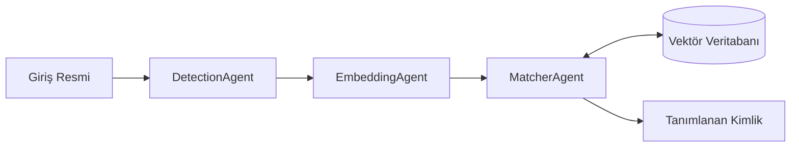

# 🐢 Sea Turtle Photo-ID: Çoklu Ajan Tabanlı Tanımlama Sistemi


Bu proje, deniz kaplumbağalarının yüzeyindeki benzersiz desenleri kullanarak bireysel tanımlama (**Photo-ID**) yapan bir yapay zeka sistemidir. Deniz biyolojisi araştırmalarında kaplumbağaların takibi için modern bir çözüm sunar.

---

## 🚀 Öne Çıkan Özellikler

- **Çoklu Ajan Mimarisi**: Tespit, Vektörleştirme ve Eşleştirme işlemleri bağımsız uzman ajanlar tarafından yürütülür.
- **Derin Öğrenme Altyapısı**: Görsel özellik çıkarımı için **EfficientNet_V2_S** modeli kullanılmıştır.
- **SOLID Prensipleri**: Kod mimarisi tamamen sürdürülebilir ve esnek bir yapıdadır.
- **Gelişmiş Veri Çoğaltma**: Farklı açılardan tanıma başarısını artırmak için veritabanında otomatik aynalama ve karıştırma stratejileri uygulanır.

---

## 🏗️ Mimari Yapı

Sistem, aşağıdaki akış şemasına uygun olarak çalışmaktadır:



### Ajanlarımızın Görevleri:
*   **DetectionAgent**: Görüntüyü normalize eder ve kaplumbağayı odaklar.
*   **EmbeddingAgent**: Resimdeki desenleri 1280 boyutlu sayısal bir "parmak izine" çevirir.
*   **MatcherAgent**: Yeni gelen kaplumbağayı veritabanındakilerle karşılaştırıp kimlik tespiti yapar.
*   **Repository**: Vektörleri güvenli ve hızlı bir şekilde saklar.

---

## 🛠️ Kurulum ve Kullanım

### 1. Gereksinimleri Yükleyin
```bash
pip install torch torchvision opencv-python scikit-learn pandas pillow
```

### 2. Veritabanını Başlatın (Hafıza Oluşturma)
Sistemin kaplumbağaları tanıması için önce veritabanını eğitmeniz/oluşturmanız gerekir:
```bash
python initialize_db.py
```

### 3. Tekli Kaplumbağa Sorgulama
Bir fotoğrafın kime ait olduğunu bulmak için:
```bash
python main.py "resim_yolu.jpg"
```

### 4. Sistem Başarısını Test Etme
Rastgele seçilen 100 örnek üzerinde doğruluk oranını ölçmek için:
```bash
python evaluate.py
```

---

## 📊 Teknolojiler

| Alan | Araçlar |
| :--- | :--- |
| **Model** | EfficientNet_V2_S |
| **Benzerlik** | Cosine Similarity (Kosinüs Benzerliği) |
| **Kütüphaneler** | PyTorch, OpenCV, Scikit-learn, Pandas |
| **Veri Saklama** | Pickle Serializer |

---

## 📝 Akademik Not
Bu proje, deniz kaplumbağalarının korunması ve takibi amacıyla geliştirilmiş bir akademik çalışmadır. %60 güven eşiği (threshold) kullanılarak hatalı eşleşmelerin önüne geçilmesi hedeflenmiştir.

---
*Geliştirici: [Semra YSLN]*
